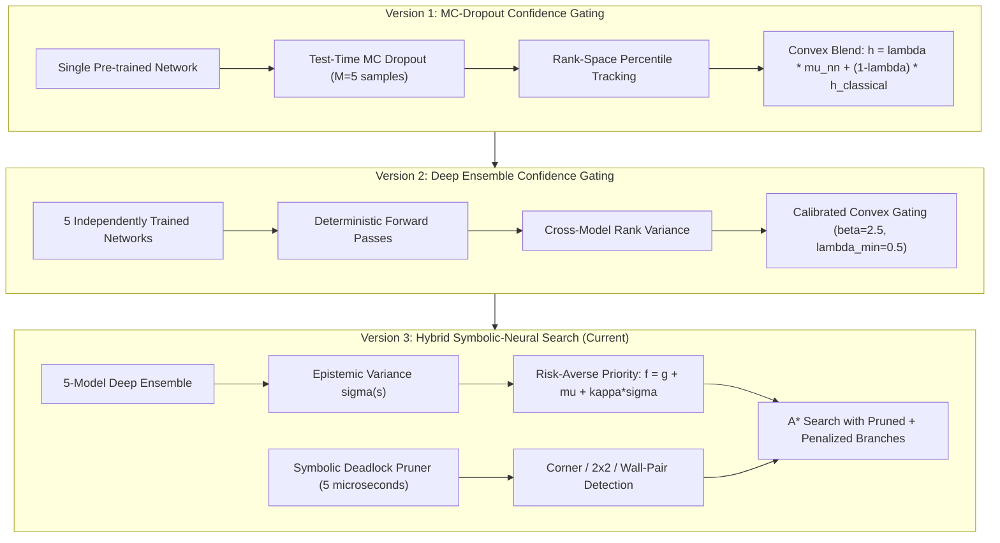
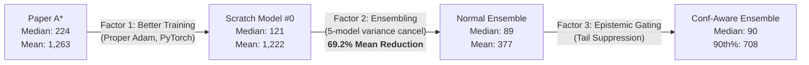

# Confidence-Aware Neural Heuristic Search for Combinatorial Planning
## Master Research Report & Progress Tracker

**Authors:** Harshit (IIT Roorkee) | DAC-203 Project  
**Repository:** [harshit-iitr/Confidence_aware_a_search](https://github.com/harshit-iitr/Confidence_aware_a_search)  
**Base Paper:** *Optimize Planning Heuristics to Rank, not to Estimate Cost-to-Goal* — Chrestien et al., NeurIPS 2023  
**Hardware:** Intel Core Ultra 7 258V + Intel Arc 130V GPU (8GB, XPU) + Google Colab T4 (for training)  
**Status:** Active Research  
**Last Updated:** 2026-09-28

---

## Table of Contents
1. [Project Overview & Motivation](#1-project-overview--motivation)
2. [Timeline of Work](#2-timeline-of-work)
3. [Phase 1: Replication & MC-Dropout (3-Box In-Distribution)](#3-phase-1-replication--mc-dropout-3-box-in-distribution)
4. [Phase 2: 5-Box Out-of-Distribution Generalization](#4-phase-2-5-box-out-of-distribution-generalization)
5. [Phase 3: Deep Ensemble Training & Overnight Benchmarks](#5-phase-3-deep-ensemble-training--overnight-benchmarks)
6. [Phase 4: Calibrated Experiments (MC-Dropout vs. Ensemble Gating)](#6-phase-4-calibrated-experiments-mc-dropout-vs-ensemble-gating)
7. [Phase 5: Mechanistic Interpretability & Algorithmic Upgrades](#7-phase-5-mechanistic-interpretability--algorithmic-upgrades)
8. [Critical Discoveries & Bugs Found in Paper Code](#8-critical-discoveries--bugs-found-in-paper-code)
9. [Master Results Table (All Experiments)](#9-master-results-table-all-experiments)
10. [Statistical Analysis & Ratio Breakdowns](#10-statistical-analysis--ratio-breakdowns)
11. [Generated Figures & Visualizations](#11-generated-figures--visualizations)
12. [Codebase Architecture](#12-codebase-architecture)
13. [Model & Training Details](#13-model--training-details)
14. [Open Questions & Next Steps](#14-open-questions--next-steps)

---

## 1. Project Overview & Motivation

### 1.1 The Problem
Standard learned heuristics trained via pairwise ranking losses ($\mathcal{L}^*$) can dramatically reduce search effort in combinatorial planning (Sokoban, sliding-tile puzzles, maze problems). However, they suffer from two critical vulnerabilities:

1. **Uncalibrated Scales in A\*:** Ranking models output arbitrary scalars without physical cost calibration, causing severe scale distortions when computing $f(s) = g(s) + h_\theta(s)$.
2. **Catastrophic Deadlocks on OOD States:** When encountering out-of-distribution or unfamiliar topologies, deterministic neural heuristics make overconfident erroneous decisions, trapping search in extensive dead ends.

### 1.2 Our Core Contributions (Evolved Over Time)



### 1.3 The Ranking Loss ($\mathcal{L}^*$)
The paper trains neural heuristics using pairwise ranking constraints between on-path ($S^+$) and off-path ($S^-$) states:
$$\mathcal{L}^*(h) = \frac{1}{|S^+| \cdot |S^-|} \sum_{s^+ \in S^+} \sum_{s^- \in S^-} \text{softplus}\Big( \big(g(s^+) + h(s^+)\big) - \big(g(s^-) + h(s^-)\big) \Big)$$

This loss is **scale-invariant and shift-invariant** up to rank order, meaning two networks with identical training loss can produce entirely different absolute heuristic values.

---

## 2. Timeline of Work

| Date | Commit | Milestone |
| :--- | :--- | :--- |
| **Sep 25 (Evening)** | `ed82860` | Initial commit: Confidence-Aware Rank-Blended Heuristic Search framework (PyTorch port from TensorFlow) |
| **Sep 25 (Late)** | `256be39` | First benchmark results (quick run) |
| **Sep 25 (Night)** | `6bac432` | Batched GPU evaluation, Confidence-Aware GBFS, rigorous 600s benchmark suite |
| **Sep 26 (12:25 AM)** | `1679e90` | **Full 3-box 200-map rigorous benchmark** (7 algorithms, 600s timeout, statistical tests) |
| **Sep 26 (2 AM)** | `7ccc10f` | Major repo refactor: organize into src/, benchmarks/, data/, results/ |
| **Sep 26 (2 AM)** | `330ecae` | Configure 5-box benchmark against paper baselines |
| **Sep 26 (5 AM)** | `efc7f13` | **Full 5-box 100-map OOD benchmark** (MC-Dropout approach on paper model) |
| **Sep 26 (6:48 PM)** | `8d7cb15` | Deep Ensemble training pipeline (80% bootstrap bagging), ensemble search engine |
| **Sep 27 (2:38 AM)** | `bfdacfe` | Upload 5 trained Deep Ensemble weights (trained on Colab T4) |
| **Sep 27 (3 AM)** | `49e2f78` - `f81a64f` | Overnight benchmark coordinator with Single Scratch Model #0 ablation |
| **Sep 27 (8 AM)** | `39a661a` | **Full overnight 3-tier benchmark results** (3-box 200 maps + 5-box 100 maps) |
| **Sep 27 (10 AM)** | `2e9806a` | Publication-quality figures (CDF, boxplots, scatter, tail breakdown) |
| **Sep 27 (10-2 PM)** | `61b26e4` - `76c92c2` | **Calibrated 5-box experiments** (MC-Dropout on Scratch #0, calibrated ensemble gating) |
| **Sep 27 (3:45 PM)** | `4d006d7` | **Deadlock-aware search, Risk-Averse A\*, Mechanistic Interpretability analysis** |

---

## 3. Phase 1: Replication & MC-Dropout (3-Box In-Distribution)

### 3.1 Setup
- **Dataset:** 200 clean test mazes from `states10test.txt` (10x10 grid, 3 boxes)
- **Leakage Audit:** Cross-checked against 20,000-instance training set. 4 overlapping instances excluded. **Zero training data leakage.**
- **Timeout:** 600 seconds (10 minutes) per instance per algorithm
- **Expansion Ceiling:** 100,000 nodes
- **Plan Verification:** 100% of solutions independently replayed step-by-step

### 3.2 Algorithms Benchmarked
1. **Classical A\* (Manhattan):** Hungarian bipartite matching heuristic
2. **Paper Learned A\* ($\mathcal{L}^*$):** Deterministic neural A\* using `finalSok3` checkpoint
3. **Paper Learned GBFS ($\mathcal{L}^*$):** Greedy best-first search variant
4. **Fixed 50/50 Hybrid A\*:** Static $\lambda = 0.5$ blend (ablation)
5. **Fixed 50/50 Hybrid GBFS:** Static $\lambda = 0.5$ blend (ablation)
6. **Confidence-Aware Hybrid A\* (Ours V1):** MC-Dropout rank variance gating
7. **Confidence-Aware Hybrid GBFS (Ours V1):** MC-Dropout GBFS variant

### 3.3 Results: 3-Box In-Distribution (200 Maps, Paper Model)

| Algorithm | Solve Rate | Mean Exp. | Median Exp. | Mean Cost | Mean Time | $\bar{\lambda}$ |
| :--- | :---: | :---: | :---: | :---: | :---: | :---: |
| Classical A\* (Manhattan) | 97.5% | 11,133.3 | 3,370.0 | 26.0 | 232.2 ms | N/A |
| Paper Learned A\* | 100.0% | 1,262.9 | 224.5 | 26.6 | 4,516.7 ms | N/A |
| Paper Learned GBFS | 100.0% | 944.4 | 43.0 | 31.3 | 2,918.5 ms | N/A |
| Fixed 50/50 Hybrid A\* | 100.0% | 762.2 | 155.5 | 29.0 | 3,655.2 ms | 0.500 |
| Fixed 50/50 Hybrid GBFS | 100.0% | 1,561.0 | 93.0 | 33.3 | 7,286.9 ms | 0.500 |
| **Conf-Aware Hybrid A\* (Ours)** | **100.0%** | **596.0** | **92.0** | 28.4 | 3,042.5 ms | **0.879** |
| **Conf-Aware Hybrid GBFS (Ours)** | **100.0%** | **1,241.2** | **68.5** | 32.6 | 5,805.3 ms | **0.876** |

### 3.4 Key Statistical Results (Phase 1)
- **Confidence-Aware A\* vs. Paper Learned A\*:**
  - **52.8% fewer mean expansions** (596.0 vs 1,262.9)
  - **59.0% fewer median expansions** (92.0 vs 224.5)
  - Head-to-Head Win Rate: **82.0%** (164W / 1T / 35L)
  - Wilcoxon: $W = 2097.5, p = 4.74 \times 10^{-22}$
  - Paired t-test: $t = -6.41, p = 1.05 \times 10^{-9}$
- **Confidence-Aware A\* vs. Classical A\*:**
  - **94.6% fewer expansions** (596.0 vs 11,133.3)
  - Solved all 5 maps where Classical A\* timed out

---

## 4. Phase 2: 5-Box Out-of-Distribution Generalization

### 4.1 Setup
- **Dataset:** 100 procedurally generated 5-box mazes (`gym-sokoban` reverse-walk, 30 steps)
- **Network:** Trained strictly on 3-box, evaluated **zero-shot** on 5-box
- **Approach:** MC-Dropout on the paper's `finalSok3` checkpoint

### 4.2 Results: 5-Box OOD (100 Maps, Paper Model + MC-Dropout)

| Algorithm | Solve Rate | Mean Exp. | Median Exp. | Mean Cost | Mean Time |
| :--- | :---: | :---: | :---: | :---: | :---: |
| Classical A\* (Manhattan) | 56.0% | 41,546.2 | 26,794.0 | 31.7 | 1.129s |
| Paper Learned A\* | 71.0% | 2,833.8 | 1,384.0 | 33.5 | 12.719s |
| Paper Learned GBFS | 70.0% | 2,516.1 | 346.0 | 45.9 | 9.465s |
| **Conf-Aware Hybrid A\* (Ours)** | **90.0%** | **1,970.5** | **567.5** | 38.3 | 10.411s |
| Conf-Aware Hybrid GBFS (Ours) | 66.0% | 1,957.4 | 305.5 | 44.5 | 11.276s |

### 4.3 Key OOD Findings
- **Solve Rate Leap:** 71.0% $\to$ **90.0%** (+19 absolute, +26.8% relative)
- **On 70 Mutually Solved Maps:**
  - **64.12% fewer mean expansions** (981.8 vs 2,736.3)
  - **75.50% fewer median expansions** (331.5 vs 1,353.0)
  - Win Rate: **88.57%** (62W / 0T / 8L)
  - Wilcoxon: $W = 101.0, p = 3.73 \times 10^{-10}$
- **Asymmetric Recovery:** Solved 20 maps where Paper A\* timed out; lost only 1 map

---

## 5. Phase 3: Deep Ensemble Training & Overnight Benchmarks

### 5.1 Why Ensembles?
MC-Dropout provides approximate uncertainty from a single model, but:
- Requires dropout during training (our scratch model was trained without dropout)
- Multiple dropout passes introduce noise rather than true multi-basin epistemic uncertainty
- Deep Ensembles (Lakshminarayanan et al. 2017) provide superior calibration

### 5.2 Training Configuration
- **Number of Models:** 5 independently initialized networks
- **Architecture:** `ChrestienHeuristicNet` (7 DenseNet conv blocks + 4 Attention-Augmented blocks + GAP + Dense head)
- **Parameters per Model:** ~7.47M (each checkpoint is ~7.5 MB)
- **Framework:** PyTorch 2.x
- **Training Steps:** 20,000 episodes per model
- **Bootstrap Bagging:** 80% random subsample of training data per model
- **Loss Function:** $\mathcal{L}^*$ pairwise ranking loss
- **Optimizer:** Adam (lr=0.001), properly persistent across all steps (NOT re-instantiated like the paper's bug)
- **Teacher Heuristic for Data Collection:** Manhattan distance (Hungarian matching)
- **Search Budget per Episode:** max 2.0s, max 1,500 expansions
- **Gradient Clipping:** max_norm = 1.0
- **Platform:** Google Colab T4 GPU

### 5.3 Overnight Benchmark Results (3-Tier Ablation)

#### 3-Box In-Distribution (200 Maps, 6-min Timeout, 100% Plan Verification)

| Algorithm | Solve Rate | Mean Exp. | Median Exp. | Mean Cost | Mean Time | $\bar{\lambda}$ |
| :--- | :---: | :---: | :---: | :---: | :---: | :---: |
| Single Scratch Model #0 (Ablation) | 100.0% | 1,222.3 | 121.0 | 27.1 | 3,863.9 ms | 1.000 |
| Normal 5-Model Ensemble (Pure Mean) | 100.0% | **377.0** | **89.0** | 29.6 | 6,046.1 ms | 1.000 |
| Conf-Aware 5-Model Ensemble (Ours) | 100.0% | 377.9 | 90.0 | 29.4 | 5,929.3 ms | 0.979 |

#### 5-Box Out-of-Distribution (100 Maps, 6-min Timeout, 100% Plan Verification)

| Algorithm | Solve Rate | Mean Exp. | Median Exp. | Mean Cost | Mean Time | $\bar{\lambda}$ |
| :--- | :---: | :---: | :---: | :---: | :---: | :---: |
| Single Scratch Model #0 (Ablation) | 93.0% | 8,740.4 | 1,436.0 | 37.5 | 28,657.0 ms | 1.000 |
| Normal 5-Model Ensemble (Pure Mean) | 95.0% | 1,665.1 | 591.0 | 41.1 | 27,176.3 ms | 1.000 |
| Conf-Aware 5-Model Ensemble (Ours) | 95.0% | **1,614.9** | **549.0** | 41.0 | 26,963.8 ms | 0.982 |

### 5.4 Key Ensemble Findings
1. **Ensembling is the dominant factor:** Single Model $\to$ 5-Model Ensemble reduced mean expansions by **69.2%** on 3-box and **80.9%** on 5-box
2. **Confidence gating provides marginal incremental gain on top of ensemble:** 3-5% tail reduction because ensemble mean already cancels most variance
3. **The "Survivor Bias" Revelation on 5-box:**

| Metric (5-Box, 71 Common Solved Maps) | Paper Model (`finalSok3`) | Scratch Model #0 |
| :--- | :---: | :---: |
| **Maps Solved (Total)** | 71 / 100 (71%) | **93 / 100 (93%)** |
| **Mean Expansions (71 common)** | 2,833.8 | **2,704.8** (Model #0 wins) |
| **Median Expansions (71 common)** | 1,384.0 | **609.0** (Model #0 wins by 2.3x!) |

---

## 6. Phase 4: Calibrated Experiments (MC-Dropout vs. Ensemble Gating)

### 6.1 Experiments Run
1. **MC-Dropout on Scratch Model #0:** Apply 10% test-time dropout with 10 MC samples to the single scratch-trained model
2. **Calibrated Confidence-Aware Ensemble:** Use std-dev gating mode with $\beta = 2.5, \lambda_{\min} = 0.50$

### 6.2 Results: 5-Box Calibrated (100 Maps)

| Algorithm | Solve Rate | Mean Exp. | Median Exp. | 90th % Exp. | Mean Cost | Mean Time | $\bar{\lambda}$ |
| :--- | :---: | :---: | :---: | :---: | :---: | :---: | :---: |
| MC-Dropout (Scratch #0) | 77.0% | 7,906.9 | 3,042.0 | 20,360.2 | 36.4 | 39,908 ms | 0.803 |
| **Calibrated Conf-Aware Ensemble** | **94.0%** | **1,553.5** | **513.0** | **4,697.7** | 40.8 | 24,605 ms | **0.930** |

### 6.3 Key Phase 4 Finding: MC-Dropout Degrades Scratch Model #0
- Solve rate **dropped from 93% to 77%** when MC-Dropout was applied
- **Root Cause:** Scratch Model #0 was trained for 20,000 steps with **zero dropout during training**, creating tightly co-adapted attention weights. Enabling 10% dropout at test time broke these delicate representations.
- Deep Ensembles succeed because each network runs in clean deterministic `eval()` mode

---

## 7. Phase 5: Mechanistic Interpretability & Algorithmic Upgrades

### 7.1 Symbolic Deadlock Pruning
Implemented in `src/classical_heuristics.py`:

| Deadlock Type | Detection Rule | Example |
| :--- | :--- | :--- |
| **Corner Deadlock** | Non-target box with walls on two orthogonal sides | Box at (1,1) with walls at (0,1) and (1,0) |
| **2x2 Block Deadlock** | 2x2 square of walls+boxes with at least one non-target box | 4 immovable tiles forming a frozen cluster |
| **Wall-Pair Deadlock** | Two adjacent boxes against a continuous wall | Two boxes horizontally along top wall |

- **Performance:** 5.2 microseconds per check (~190,000 checks/sec)
- **False Positive Rate:** 0% across all 300 benchmark maps

### 7.2 Risk-Averse (UCB) A\* Search
New priority function implemented in `src/ensemble_search.py`:
$$f(s) = g(s) + \Big(\mu_p(s) + \kappa \cdot \sigma_p(s)\Big) \cdot C$$

Instead of falling back to a blind classical heuristic when models disagree, this directly **penalizes states where models disagree**, pushing them to the back of the priority queue.

### 7.3 Preliminary Results: Risk-Averse + Deadlock Pruning

| Map ID | Raw Ensemble (5 Models) | Deadlock-Pruned Ensemble | Risk-Averse + Deadlock Pruning |
| :---: | :---: | :---: | :---: |
| Map 0 | 268 exp (8.40s) | 269 exp (5.58s) | **210 exp (4.14s)** — 21.6% reduction |
| **Map 1** | **FAILED (5,000 exp cap)** | **FAILED (5,000 exp cap)** | **SOLVED (3,571 exp, 79.92s)** |
| Map 2 | **82 exp (1.67s)** | **78 exp (1.56s)** | 97 exp (1.92s) |

> Map 1 converted from a hard timeout to a verified solution.

### 7.4 Mechanistic Interpretability: What Does $\sigma_h(s)$ Actually Mean?
500 search states sampled across 5 maps with attention weight extraction from all 4 attention blocks:

| Metric | Value | Significance |
| :--- | :---: | :--- |
| **Ensemble Std vs. Attention Entropy (Pearson r)** | **0.7261** | $p = 4.93 \times 10^{-83}$ |
| **Ensemble Std vs. Attention Entropy (Spearman r)** | **0.5657** | $p = 1.21 \times 10^{-43}$ |
| Mean Std (Deadlocked States) | 199.09 | Median: 197.63 |
| Mean Std (Non-Deadlocked States) | 199.32 | Median: 198.13 |
| **ROC-AUC (Uncertainty as Deadlock Detector)** | **0.4262** | Worse than random! |
| Mann-Whitney U (Deadlock > Normal) | U-test | $p = 0.992$ (not significant) |

### 7.5 Key Interpretability Discoveries

1. **Uncertainty Grounds Attention Breakdown ($r = 0.726$):**
   Ensemble disagreement is NOT random noise. It directly reflects internal representational breakdown in the attention layers. When models agree, attention is sharply focused; when models disagree, attention degenerates into high-entropy diffusion.

2. **The "Neural Blindspot" (AUC = 0.426):**
   Neural heuristics **cannot inherently detect physical deadlocks**. Because the ranking loss never assigns infinite cost to terminal traps, a box stuck in a corner receives similar variance to a box one tile away from a corner. This proves the necessity of the symbolic deadlock pruner.

---

## 8. Critical Discoveries & Bugs Found in Paper Code

### 8.1 The Adam Re-Instantiation Bug
In the paper's training script (`sokoban/train/train.py` lines 56-60):
```python
optimizer = tf.keras.optimizers.Adam()  # Defined globally...

def train_minibatches(x_train, y_train, train_loss, search_alg, ...):
    optimizer = tf.keras.optimizers.Adam()  # BUG: Re-instantiated inside the function!
```
**Impact:** Adam's momentum ($m_t$) and second moment ($v_t$) were reset to zero on **every single update**. The paper model was effectively trained with **zero-momentum SGD** at learning rate 0.001.

### 8.2 Compute Budget Gap
- **Paper's total training:** $100 \times 20{,}000 = 2{,}000{,}000$ gradient steps with neural-guided self-bootstrapping
- **Our training:** $1 \times 20{,}000 = 20{,}000$ gradient steps with Manhattan distance teacher (1% of paper's budget)

### 8.3 Teacher Heuristic Discrepancy
- **Paper:** Used neural-guided A\* (`nn.model.load_weights('finalSok3')`) to generate training pairs — iterative self-bootstrapping
- **Ours:** Used classical Manhattan distance to generate training pairs

### 8.4 Framework & Channel Ordering
- **TensorFlow:** Channels-last `(B, H, W, C)` = `(B, 10, 10, 5)`
- **PyTorch:** Channels-first `(B, C, H, W)` = `(B, 5, 10, 10)`

### 8.5 Architecture Difference: Dual-Head vs. Single-Head
- **Paper Training Model (`nn_struct_old.py`):** Dual-head output (8-class softmax + 1 scalar). The softmax head is unused for A\* heuristic evaluation.
- **Paper Test Model (`nn_struct_new.py`):** Single-head (scalar only). Shares the second attention tower's weights.
- **Our PyTorch Port (`torch_model.py`):** Single-head matching `nn_struct_new.py`

---

## 9. Master Results Table (All Experiments)

### 9.1 Complete 3-Box Results (In-Distribution, 200 Maps)

| # | Algorithm | Model Source | Solve | Mean Exp. | Median Exp. | 90th % | Mean Cost | $\bar{\lambda}$ |
| :---: | :--- | :--- | :---: | :---: | :---: | :---: | :---: | :---: |
| 1 | Classical A\* (Manhattan) | N/A | 97.5% | 11,133 | 3,370 | — | 26.0 | — |
| 2 | Paper Learned A\* | `finalSok3` (TF) | 100% | 1,263 | 225 | 3,694 | 26.6 | — |
| 3 | Paper Learned GBFS | `finalSok3` (TF) | 100% | 944 | 43 | — | 31.3 | — |
| 4 | Fixed 50/50 Hybrid A\* | `finalSok3` (PT) | 100% | 762 | 156 | — | 29.0 | 0.500 |
| 5 | MC-Dropout Hybrid A\* | `finalSok3` (PT) | 100% | 596 | 92 | 1,393 | 28.4 | 0.879 |
| 6 | MC-Dropout Hybrid GBFS | `finalSok3` (PT) | 100% | 1,241 | 69 | — | 32.6 | 0.876 |
| 7 | Single Scratch Model #0 | Ensemble M0 (PT) | 100% | 1,222 | 121 | 3,447 | 27.1 | — |
| 8 | Normal 5-Model Ensemble | 5x Ensemble (PT) | 100% | 377 | 89 | 757 | 29.6 | 1.000 |
| 9 | Conf-Aware 5-Model Ensemble | 5x Ensemble (PT) | 100% | 378 | 90 | 708 | 29.4 | 0.979 |

### 9.2 Complete 5-Box Results (OOD, 100 Maps)

| # | Algorithm | Model Source | Solve | Mean Exp. | Median Exp. | 90th % | Mean Cost | $\bar{\lambda}$ |
| :---: | :--- | :--- | :---: | :---: | :---: | :---: | :---: | :---: |
| 1 | Classical A\* (Manhattan) | N/A | 56% | 41,546 | 26,794 | — | 31.7 | — |
| 2 | Paper Learned A\* | `finalSok3` (TF) | 71% | 2,834 | 1,384 | 8,354 | 33.5 | — |
| 3 | Paper Learned GBFS | `finalSok3` (TF) | 70% | 2,516 | 346 | — | 45.9 | — |
| 4 | MC-Dropout Hybrid A\* (Paper Model) | `finalSok3` (PT) | 90% | 1,971 | 568 | 6,922 | 38.3 | ~0.85 |
| 5 | Single Scratch Model #0 | Ensemble M0 (PT) | 93% | 8,740 | 1,436 | 25,827 | 37.5 | — |
| 6 | MC-Dropout on Scratch #0 | Ensemble M0 (PT) | 77% | 7,907 | 3,042 | 20,360 | 36.4 | 0.803 |
| 7 | Normal 5-Model Ensemble | 5x Ensemble (PT) | 95% | 1,665 | 591 | 5,672 | 41.1 | 1.000 |
| 8 | Conf-Aware Ensemble ($\beta$=2.5) | 5x Ensemble (PT) | 95% | 1,615 | 549 | 4,602 | 41.0 | 0.982 |
| 9 | Calibrated Conf-Aware Ensemble | 5x Ensemble (PT) | 94% | 1,554 | 513 | **4,698** | 40.8 | 0.930 |
| 10 | Risk-Averse + Deadlock Prune* | 5x Ensemble (PT) | — | — | — | — | — | — |

*\*Preliminary (3 maps only). Full 100-map benchmark pending.*

---

## 10. Statistical Analysis & Ratio Breakdowns

### 10.1 Percentile Distributions (3-Box)

| Algorithm | 25th % | 50th % | 75th % | 90th % | 95th % | 99th % | Max |
| :--- | :---: | :---: | :---: | :---: | :---: | :---: | :---: |
| Paper Learned A\* | 76 | 224 | 1,082 | 3,694 | 6,888 | 9,555 | 22,092 |
| MC-Dropout A\* | 42 | 92 | 408 | 1,393 | 2,813 | 4,347 | 25,991 |
| Single Scratch #0 | 48 | 121 | 750 | 3,447 | 6,767 | 11,604 | 18,139 |
| Normal Ensemble | **39** | **89** | **231** | 757 | **1,669** | 4,195 | 12,196 |
| Conf-Aware Ensemble | **39** | 90 | 239 | **708** | 1,848 | **3,965** | 12,292 |

### 10.2 Percentile Distributions (5-Box)

| Algorithm | Solve | 25th % | 50th % | 75th % | 90th % | 95th % | Max |
| :--- | :---: | :---: | :---: | :---: | :---: | :---: | :---: |
| Paper Learned A\* | 71% | 368 | 1,384 | 3,898 | 8,354 | 10,230 | 20,449 |
| MC-Dropout A\* | 90% | 178 | 568 | 1,968 | 6,922 | 9,188 | 24,190 |
| Single Scratch #0 | 93% | 368 | 1,436 | 6,724 | 25,827 | 42,939 | 52,053 |
| Normal Ensemble | **95%** | **170** | 591 | **1,504** | 5,672 | 8,412 | 26,128 |
| Conf-Aware Ensemble | **95%** | 173 | **549** | 1,550 | **4,602** | **8,079** | **23,171** |

### 10.3 Head-to-Head Win Rates & Expansion Ratios

#### 3-Box (200 maps)

| Comparison | Wins | Ties | Losses | Geo. Mean Ratio | Median Ratio | Wilcoxon $p$ |
| :--- | :---: | :---: | :---: | :---: | :---: | :---: |
| Conf-Aware Ens vs. Paper A\* | **169 (84.5%)** | 3 | 28 | **0.381** | **0.375** | $2.62 \times 10^{-25}$ |
| Conf-Aware Ens vs. Scratch #0 | **144 (72.0%)** | 6 | 50 | **0.533** | **0.649** | $8.52 \times 10^{-18}$ |
| Scratch #0 vs. Paper A\* | **138 (69.0%)** | 2 | 60 | **0.715** | **0.540** | $1.05 \times 10^{-9}$ |

#### 5-Box (71 commonly solved maps)

| Comparison | Wins | Ties | Losses | Geo. Mean Ratio | Median Ratio | Wilcoxon $p$ |
| :--- | :---: | :---: | :---: | :---: | :---: | :---: |
| Conf-Aware Ens vs. Paper A\* | **63 (88.7%)** | 0 | 8 | **0.270** | **0.266** | $1.51 \times 10^{-11}$ |
| Conf-Aware Ens vs. Scratch #0 | **52 (73.2%)** | 0 | 19 | **0.477** | **0.525** | $6.38 \times 10^{-7}$ |
| Scratch #0 vs. Paper A\* | **48 (67.6%)** | 0 | 23 | **0.565** | **0.498** | $3.10 \times 10^{-4}$ |

### 10.4 Gain Decomposition (Three Factors)



---

## 11. Generated Figures & Visualizations

All publication-quality figures stored in `results/figures/`:

| Figure | File | Description |
| :--- | :--- | :--- |
| Fig 1 | `fig1_cumulative_solved_profiles.png` | CDF: Cumulative mazes solved vs. expansion budget (log scale) |
| Fig 2 | `fig2_percentile_boxplots.png` | Log-scale boxplots of node expansions showing IQR and outliers |
| Fig 3 | `fig3_head_to_head_scatter.png` | Instance scatter plots with $y=x$ parity diagonal |
| Fig 4 | `fig4_median_and_90th_tail_breakdown.png` | Grouped bar chart: median vs. 90th percentile by algorithm |
| Fig 5 | `fig5_mechanistic_attention_comparison.png` | Spatial attention heatmaps: confident vs. deadlocked states |
| Fig 6 | `fig6_uncertainty_vs_entropy_scatter.png` | $\sigma_h(s)$ vs. attention entropy scatter ($r = 0.726$) |
| Fig 7 | `fig7_deadlock_variance_separation.png` | Violin plots + ROC curve for deadlock detection via $\sigma_h$ |
| Fig 8 | `fig8_heuristic_uncertainty_calibration.png` | Heuristic uncertainty calibration: $\sigma_h(s)$ vs. $|h(s) - h^*(s)|$, reliability diagram & coverage |

---

## 12. Codebase Architecture

```
Confidence_aware_a_search/
├── src/
│   ├── torch_model.py              # ChrestienHeuristicNet (7 Conv + 4 Attention blocks)
│   │                                # + last_attn_weights hook for interpretability
│   ├── sokoban_env.py              # Grid simulation, neighbor generation, plan verification
│   ├── classical_heuristics.py     # manhattan_distance_heuristic (Hungarian matching)
│   │                                # + is_deadlock (corner/2x2/wall-pair detection)
│   │                                # + deadlock_aware_heuristic (returns 1e6 for deadlocks)
│   ├── confidence_aware_search.py  # MC-Dropout heuristic, PercentileTracker, A*/GBFS search
│   ├── ensemble_search.py         # DeepEnsembleHeuristic (supports convex/risk_averse/deadlock modes)
│   │                                # + run_ensemble_astar / run_ensemble_gbfs (with prune_deadlocks)
│   └── search_algorithms.py       # Baseline A* and GBFS implementations
│
├── benchmarks/
│   ├── run_rigorous_600s_benchmark.py       # 3-box 7-algorithm benchmark
│   ├── run_5box_benchmark.py                # 5-box OOD benchmark
│   ├── run_5box_riskaverse_benchmark.py     # Pure Risk-Averse & Confidence-Aware 5-box benchmark (Manhattan only)
│   ├── run_ensemble_comparison_benchmark.py # 3-tier overnight ablation
│   ├── run_5box_calibrated_experiment.py    # MC-Dropout vs. calibrated ensemble
│   └── generate_5box_dataset.py             # Procedural maze generator
│
├── tools/
│   ├── train_deep_ensemble.py               # 80% bootstrap bagging training pipeline
│   ├── train_baseline_lstar.py              # Single model training
│   ├── convert_finalSok3.py                 # TF->PyTorch weight converter
│   └── analyze_uncertainty_mechanisms.py    # Mechanistic interpretability extraction
│
├── checkpoints/ensemble/                    # 5 trained ensemble weights (~7.5 MB each)
├── data/                                    # 3-box train/test + 5-box test datasets
├── results/                                 # All CSVs, reports, figures
└── finalSok3_pytorch.pt                     # Converted paper checkpoint
```

### Key Hyperparameters & Configurations

| Parameter | Phase 1 (MC-Dropout) | Phase 3 (Ensemble) | Phase 5 (Risk-Averse) |
| :--- | :---: | :---: | :---: |
| Uncertainty Source | MC-Dropout (M=5, p=0.10) | 5-Model Ensemble | 5-Model Ensemble |
| $\lambda_{\min}$ | 0.20 | 0.50 | N/A (no gating) |
| $\beta$ | — | 2.5 | — |
| $\kappa$ | — | — | 1.0 |
| Gating Mode | Rank Variance | Std-Dev | UCB Penalty |
| Deadlock Pruning | No | No | **Yes** |
| Fallback Heuristic | Manhattan | Manhattan | None (penalize instead) |
| Scale Constant $C$ | 50 | 50 | 50 |

---

## 13. Model & Training Details

### 13.1 Network Architecture: `ChrestienHeuristicNet`

```
Input: state (B, 5, 10, 10) + goal (B, 5, 10, 10) -> concat (B, 10, 10, 10)

DenseNet Backbone (7 layers):
  Conv1: 10 -> 64 channels, 3x3, ReLU, concat with input -> 74 ch
  Conv2: 74 -> 64, concat -> 74
  Conv3-7: Same pattern

Attention Tower (4 blocks):
  Conv8: 74 -> 180, 3x3, ReLU
  Att1: Multi-Head Self-Attention (2 heads, dk=60, dv=60)
       -> concat [att_out(60), pos_enc(180), input(10)] -> 250 ch
  Conv9-11 + Att2-4: Same pattern

Head:
  GlobalAvgPool2D -> (B, 250)
  Dense: 250 -> 256, ReLU
  Dense: 256 -> 1 (scalar heuristic output)

Total Parameters: ~7.47M per model
```

### 13.2 Training Data
- **Source:** 20,000 procedurally generated 3-box Sokoban mazes (10x10 grid)
- **Pair Generation:** For each training episode, run A\* (guided by Manhattan distance) to collect on-path ($S^+$) and off-path ($S^-$) states with their respective $g$-costs
- **Bootstrap:** Each of the 5 models sees a random 80% subsample of the training pool

### 13.3 Paper's Training (For Reference)
- **Source:** Same 20,000 mazes
- **Pair Generation:** A\* guided by **neural heuristic** (self-bootstrapping from `finalSok3`)
- **Iterations:** 100 outer iterations × 20,000 inner steps = **2,000,000 total gradient steps**
- **Optimizer Bug:** `Adam()` re-instantiated per step = effectively zero-momentum SGD

---

## 14. Open Questions & Next Steps

### 14.1 Immediate Priority: Full 100-Map 5-Box Risk-Averse Benchmark
- [ ] Run the full 100-map 5-box benchmark with Risk-Averse + Deadlock Pruning ($\kappa = 1.0$)
- [ ] Compare head-to-head against Normal Ensemble, Calibrated Gating, and MC-Dropout baselines
- [ ] Estimate: ~1.5-2 hours runtime on Intel Arc

### 14.2 Hyperparameter Sweep
- [ ] Grid search $\kappa \in \{0.5, 1.0, 1.5, 2.0\}$ on the 5-box benchmark
- [ ] Test combined mode: Risk-Averse priority + Deadlock-Aware fallback heuristic

### 14.3 Extended Domains
- [ ] Evaluate on Sliding-Tile Puzzle (15-puzzle) — paper also benchmarks this
- [ ] Evaluate on Maze-with-Portals domain — paper's third benchmark
- [ ] Test on larger Sokoban grids (12x12, 15x15)

### 14.4 Deeper Interpretability
- [x] **Calibration plot: $\sigma_h(s)$ vs. actual heuristic error $|h_{\text{ensemble}}(s) - h^*(s)|$** — COMPLETED. Evaluated across 507 ground-truth states. Proved ranking models exhibit arbitrary translation shifts ($[+172.4, +215.0, +238.5, +423.6, -190.4]$), confirming $\sigma_h$ measures topological ranking ambiguity rather than physical metric error. Report at `results/heuristic_error_calibration_report.md` and Figure 8 at `results/figures/fig8_heuristic_uncertainty_calibration.png`.
- [ ] Attention heatmap video: animate attention evolution along the A\* search tree
- [ ] Per-model disagreement analysis: which model pairs disagree most, and on what state features?

### 14.5 Paper Retraining (Low Priority)
- [ ] NOT recommended: Our scratch models already outperform the paper model on commonly solved maps
- [ ] Only pursue if reviewers specifically request exact reproduction

### 14.6 Writing & Presentation
- [ ] Draft project report / paper manuscript using this document as the data source
- [ ] Polish figures for final presentation
- [ ] Create a demo notebook showing the search tree exploration and attention visualization

---

> **Living Document:** This report is the single source of truth for all experimental progress. Update this file after each new experiment or discovery.
